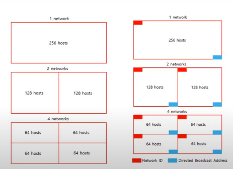

# Basic of Network

## IPv4, subnet, classful vs classless system
* https://www.youtube.com/watch?v=ZBGna6KPZ3k (a lecture video in Korean)
* What is IPv4?
    * length of address = 4 bytes = 32 bits
    * number of adderesses = 2^32
* Classful address system
    * First byte in the address
        * Class A: 0 + 7bits -> 0-127
        * Class B: 10 + 6 bits -> 128-191
        * Class C: 110 + 5 bits -> 192-223
            * usually assigned for home computers
        * Class D: 1110 + 4 bits -> 224-239
        * Class E: others -> 240-255
    * IP Address -> 192.168.35.248 (Class C)
        * Network Address: 192.168.35.0
            * "11000000 10101000 00100011" 00000000
            * Class C -> use first 3 bytes -> rest would be 0
        * Host Address: 192.168.35.1-192.168.35.254
        * Broad Cast Address: 192.168.35.255
            * 11000000 10101000 00100011 11111111
* What is Subnet?
    * divide network -> more efficient IP management
    * Class C -> 256 hosts
    * 
* Subnet mask:
    * use AND operations on IP address && subnetmask -> we can get host addresses
    * ex. ip: 150.150.100.1 & subnet mask: 255.255.255.0 -> 150.150.100.0
        * 150.150.100 -> Network area
        * X.X.X.0 -> Host area -> Host addresses
* Classless address system
    * prefix + suffix
        * prefix = network ID
        * suffix = host ID
    * netid + subnet ID + hostid
    * ex. 192.168.35.248/21 in classless system -> find subnet, host area, borad cast address
        * prefix + subnetid = first 21 characters -> rest would be suffix
        * IP 
            "11000000 10101000 00100"011 11111000/21
        * subnet: 255.255.248.0
            * "11111111 11111111 11111"000 00000000
        * network address: 192.168.32.0
            * "11000000 10101000 00100"000 00000000
        * host area: 192.168.32.1 ~ 192.168.39.254
            * "11000000 10101000 00100"000 00000001 ~
            * "11000000 10101000 00100"111 11111110
        * broad cast address: 192.168.39.255
            * "11000000 10101000 00100"111 11111111